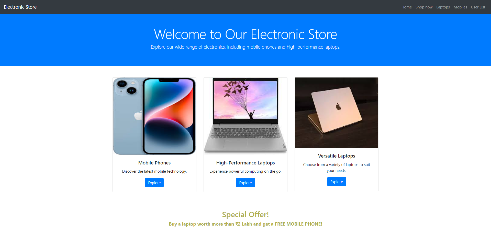
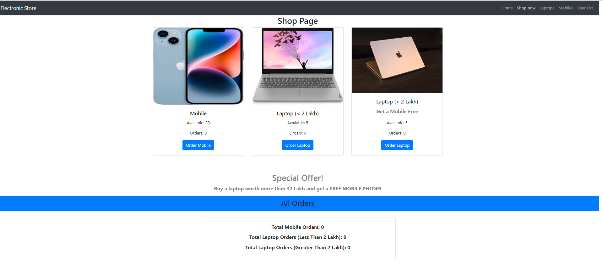
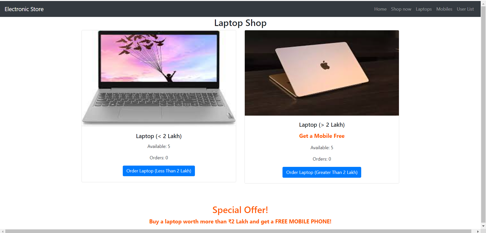
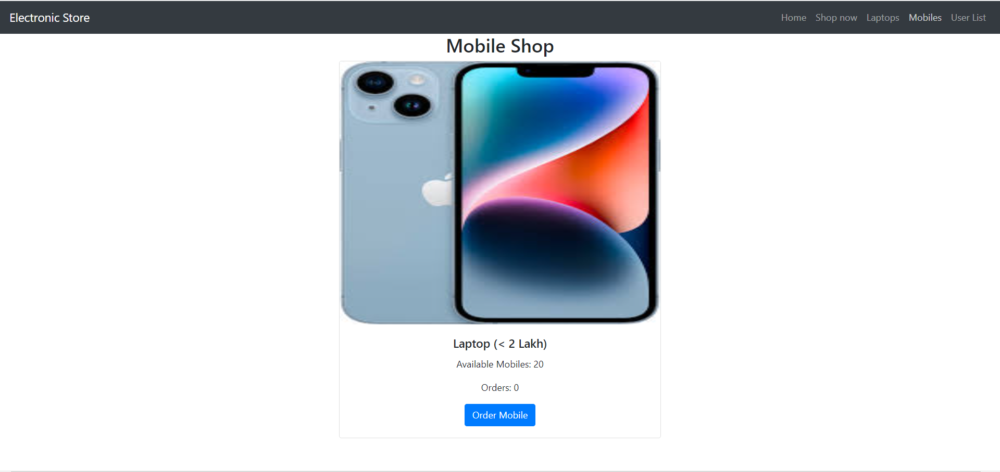
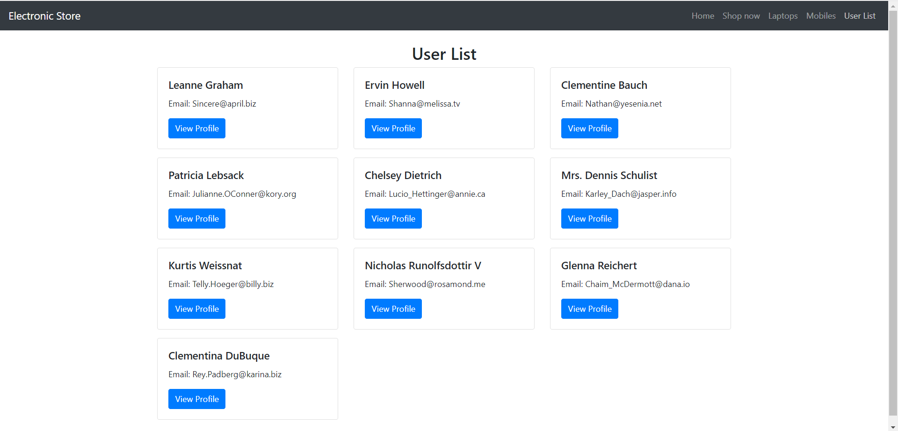
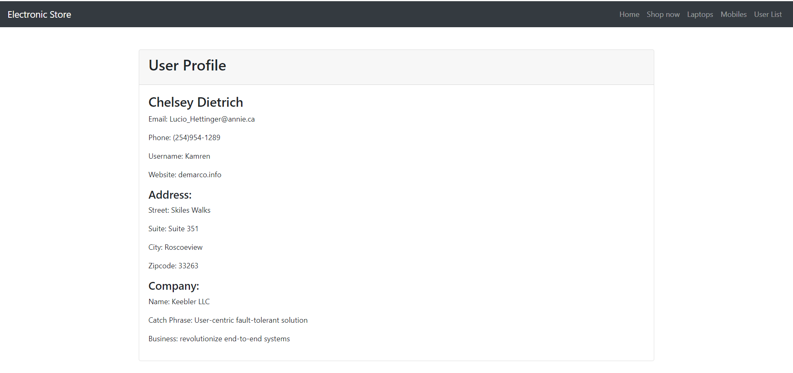
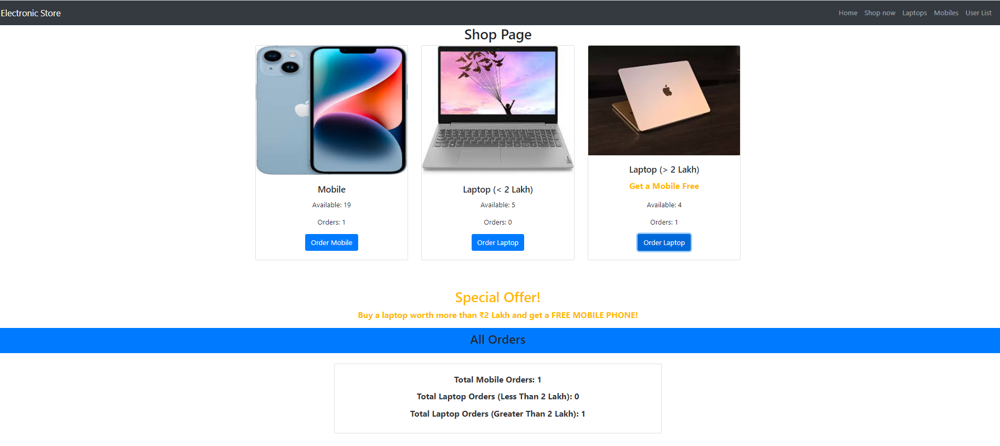

# Electronic Store

## Description

Welcome to the Electronic Store! This e-commerce platform allows users to browse and purchase a wide range of electronic products. This README.md file provides an overview of the project, its features, and instructions for running it locally.

## Project Links

* Github- [Electronic Store on GitHub](https://github.com/saurabhkumarr99/Electronic-Store)
* Live Website- [Go to Live Electronic Store Website](https://saurabhkumarr99.github.io/Host-Electronic-Store/)

## Table of Contents

- [Features](#features)
- [Getting Started](#getting-started)
- [Usage](#usage)
- [Code Structure](#code-structure)
- [Screenshots](#screenshots)
- [Author](#Author)

## Features

- **Product Catalog:** Browse through an extensive catalog of electronic products.
- **Product Details:** View detailed information about each product, including specifications, images, and prices.
- **Checkout:** Complete the purchase process by providing shipping and payment information.
- **Order History:** View a history of your past orders.
- **User List:** Browse a list of registered users on the platform.
- **User Profile:** View user profile information.
- **Responsive Design:** Enjoy a seamless shopping experience on both desktop and mobile devices.


## Getting Started

### Prerequisites

- Node.js and npm (Node Package Manager) installed on your computer.
- Node.js: [Download and Install Node.js](https://nodejs.org/)

Follow these steps to run the Blog App locally:

1. **Unzip the Electronic Store App:**

2. **Navigate to the project directory:**

   ```bash
   cd Electronic-Store
   ``` 

2. **Install Dependencies:**

   ```bash
   npm install
   ``` 

3. **Run:**

   ```bash
      npm start
   ``` 


## Usage

1. **Shop Products** 
2. **Laptops List**
3. **Mobile List** 
4. **Order Count**
5. **All User**
6. **User Profile**

## Code Structure

The project follows a structured directory layout for better organization:

- **public/**: Public files like HTML and manifest.
  - `images/`: Folder containing project images. 
  - `index.html`: The HTML template file where the React app is mounted.
  - `manifest.json`: The manifest file for progressive web apps.


- **ScreenShots**: Folder conatining screenshots here.

- **src/**: Contains the source code of the project.
  - **allComponents/**: React components.
    - `Header.js`: Navbar resides in header.
    - `Home.js`: The home page component.
    - `LaptopStock.js`: This page content laptop stock information.
    - `MobileStock.js`: This page content mobile stock information.
    - `ShopPage.js`: User can buy products from this page.
    - `UserList.js`: All users will be dispaly here.
    - `UserProfiles.js`: Userprofile will be dispaly here.
  - **redux**: Redux folder.
    - **slices**: Redux folder.
      - `LaptopSlice.js`
      - `mobileSlice.js`
      - `useSlice.js`
    - `store.js`: The home page component.
  - **assets/**: Images, styles, and other assets.
    - `images/`: Folder containing project images.
    - `styles/`: Folder containing project CSS styles.
  - `App.js`: The main application file that sets up routing and renders components.

- `package.json`: The project dependencies and scripts configuration.

- `README.md`: This file, which provides an overview of the project's structure and usage instructions.

## Screenshots

<p align="center">
  
  
  
  
  
  
  
</p


## Author

- SAURABH KUMAR RAI

